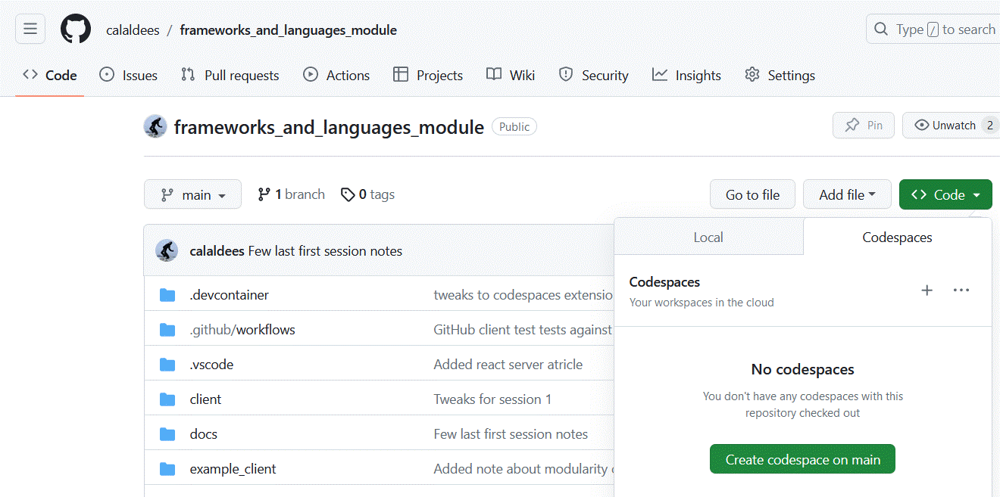

Server Frameworks
-----------------

### Objectives
* Understand how to follow a tutorial to run "Hello World" for a range of server side frameworks
* Start to understand a range of server frameworks features
    * To justify your choice of server framework (assignment 2)

### Tasks for next week
1. Use a server framework + pass more tests
    * Explore a server framework on your own by attempting to follow a tutorial
    * Run "Hello World" server
    * Return a JSON response (e.g. `GET /test --> {"foo": "bar"}`)
    * Return a JSON response for Assignment 1 (e.g. `GET /items --> []`)
2. Attempt to write about a server framework features in `technical_report.md`

### This afternoon
* Full worked example of RSPV server in Express.js

### Next week
* Writing Workshop
* Few last server bits
    * [Cross-origin resource sharing](https://en.wikipedia.org/wiki/Cross-origin_resource_sharing)
        * HTTP `OPTIONS` request with `Access-Control-Allow-Origin`
* Client frameworks
    * [Single-page application](https://en.wikipedia.org/wiki/Single-page_application)
    * Hello World

    


Overview
--------

* Terminology + Tech (30min)
    * Middleware
* Live code server framework tutorials
    * Django Tutorial (1.5 hour)
    * Falcon (30 min)
    * dotnet (15min)
    * express.js (30 min)
    * sanic (if time?)
* Assignment 2 Overview (30min)


History + Terms
---------------

* [REST: Representational state transfer](https://en.wikipedia.org/wiki/Representational_state_transfer)
    * > RESTful web APIs are typically loosely based on HTTP methods to access resources via URL-encoded parameters and the use of JSON or XML to transmit data.
    * GET, POST, DELETE, PUT, PATCH
    * REST is loosely related to CRUD in database's
    * A layer of abstraction from datastore with some business/application logic
* [Common Gateway Interface (CGI)](https://en.wikipedia.org/wiki/Common_Gateway_Interface)
    * Just drop a script in an executable folder (new process on each request)
* Web Server (Python example)
    * > WSGI is a standard interface which allows to seperate server code from the application code where you add your business logic. WSGI succeeded in allowing much more freedom and innovation in the Python web space.
    * But can't handle persistant http2 and websocket connections required by some modern services
    * [Web Server Gateway Interface (WSGI)](https://en.wikipedia.org/wiki/Web_Server_Gateway_Interface)
        * Connect web server (Apache, Nginx) to application logic (Python)
    * [Asynchronous Server Gateway Interface (ASGI)](https://en.wikipedia.org/wiki/Asynchronous_Server_Gateway_Interface)
        * [Difference between WSGI and ASGI?](https://medium.com/analytics-vidhya/difference-between-wsgi-and-asgi-807158ed1d4c)
* [Middleware](https://en.wikipedia.org/wiki/Middleware)
    * Pre-request + Post-response hooks
    * Like _decorators_ (the language feature we looked at in the languages session)
* Traditional web applications - server templates
* [Single-page application](https://en.wikipedia.org/wiki/Single-page_application)
    * A single-page application (SPA) is a web application or website that interacts with the user by dynamically rewriting the current web page with new data from the web server, instead of the default method of a web browser loading entire new pages. The goal is faster transitions that make the website feel more like a native app. 
* WebSockets
    * ongoing bidirectional connections - many server frameworks now support this
    * This is in addition to REST


Features of Server Frameworks
-----------------------------

Features probably needed for Assignment 1

* Routing
    * matching urls to functions/code
* Views
    * The logic of the application
* Data handling tools
    * Input - urlencoding, form encoding, json
    * Output - text, json, xml
* Middleware

Features probably not needed for Assignment 1

* Model - Datamodel (ORM)
* Templates
    * Rendering data into an html layout (on the server)
* Serializers (output data)
    * Streams
* Security/Authentication framework
* Websockets (realtime bi-directional)
* Plugin or expansion framework


Server Frameworks
-----------------

Live coded examples


### Django (Python)


What is a server side framework?
Let's do a tutorial to find out what the components are.
(this is just to explore the further features - remember our goal for the assignment is to create a RESTApi to a spec)

* https://www.djangoproject.com/
    * Install Django
    * Tutorial Part 1 to Part 3
* Let's live code!
    * new codespace (on your fork)
    * 
    * or https://github.com/codespaces/ (quick start 'blank')
    * https://gitpod.io/#https://github.com/gitpod-io/template-python-django
    * `f1` toggle autosave (off)
    * Skip `python manage.py shell` model bit
    

<details>
<summary>Implementation notes</summary>

* Part2 of tutorial missed out adding `Choice` to admin?
    * `admin.site.register(Choice)`

csrf trusted origins? no longer needed?
```python
# mysite/settings.py 
# addition
# https://docs.djangoproject.com/en/dev/ref/settings/#csrf-trusted-origins
CSRF_TRUSTED_ORIGINS = [
    'http://*.gitpod.io',
    'https://*.gitpod.io',
]
```

```python
from django.core import serializers
from django.http import JsonResponse
def index(request):
    return JsonResponse(
        serializers.serialize("python", Question.objects.all()),
        safe=False,
    )
```

```
{# <p>This is comment in Django templates</p> #}
```
</details>


#### Further Django Reading
* [Django Girls Tutorial](https://tutorial.djangogirls.org/en/)
    * Wonderful tutorial from the basics up
* [Why Django is the Best Web Framework for Your Project](https://steelkiwi.com/blog/why-django-best-web-framework-your-project/)
    * Not suited for small-scale projects
    * No default support for WebSockets
    * Monolithic
    * Django’s behavior is sometimes hard to tune
* [Django Framework Review - Pros and Cons](https://www.netguru.com/blog/django-pros-and-cons)
* [10 Django Trouble Spots for Beginners](https://code.tutsplus.com/tutorials/10-django-trouble-spots-for-beginners--net-12012)
* [About my experience of using Django Framework](https://emacsway.github.io/en/django-framework/)

### TODO
* [Anatomy of a Django/HTMX Project](https://danjacob.net/posts/anatomyofdjangohtmxproject/)
* [Appliku](https://appliku.com/) - Deploy Django in 5 minutes - to most cloud providers


### Falcon Framework (Python)


* http://falconframework.org/
    * [quickstart](https://falcon.readthedocs.io/en/stable/user/quickstart.html)
    * [on_post req.media](https://falcon.readthedocs.io/en/stable/api/media.html#usage)

Let's build it - livecode
* combine 
    * falconframework.org `sample.py` (we don't want gunicorn)
    * quickstart `things.py` (we want the json return from sample.py)
* containerize (just watch, you'll attempt this later)
    * Build Makefile and Dockerfile

* https://www.fullstackpython.com/falcon.html
    * > Falcon is a WSGI-compliant web framework designed to build RESTful APIs without requiring external code library dependencies.

* https://impythonist.wordpress.com/2015/09/12/build-massively-scalable-restful-api-with-falcon-and-pypy/
    * > If you build a RESTFul API for some purpose, what technology stack you use in python and why?. I may receive the following answers from you.
      > 1)  I use Flask with Flask-RESTFul
      > 2)  I use (Django + Tastypie) or (Django + REST Framework)
      > Both options are not suitable for me. Because there is a very good light-weight API framework available in python called Falcon. I always keep my project and REST API loosely coupled. It means my REST API knows little about the Django or Flask project that is being implemented. Creating cloud API’s with low-level web framework than a bulky wrapped one always speeds up my API.


### Django REST Framework (Python)


https://www.django-rest-framework.org/

A framework, built on another framework

https://www.fullstackpython.com/django-rest-framework-drf.html
https://www.django-rest-framework.org/tutorial/quickstart/

* Web visible interface for exploration
* Pagination
* Multiple dateformat serializers
* Generates openAPI spec from working program


### ASP Core dotnet (c#)

1. build and run the example application (probably want to do these commands separately)
    * `mkdir -p dotnettest && cd dotnettest && dotnet new web && dotnet run`
        * open webpage at port `5156`
    * (more examples at `/examples/server/dotnet6`)
2. add json return
    * for route `/test` based on https://learn.microsoft.com/en-gb/aspnet/core/fundamentals/use-http-context?view=aspnetcore-7.0#get-request-headers


### Falco (F#)

* https://www.falcoframework.com/
    * > Functional-first toolkit for building brilliant ASP.NET Core applications using F#. 
    * https://github.com/pimbrouwers/Falco F# functional
    

### Blazor (C#)

Abstracting the entire server/client into one amorphous mega blog that deploys on the cloud

* [Blazor](https://dotnet.microsoft.com/en-us/apps/aspnet/web-apps/blazor)
    * server/client state super framework (covered in later session)
    * Key concept - "eventual consistency" - creating invalidation methods is key
    * https://github.com/servicetitan/Stl.Fusion C# Super server+client mega solution


### Sanic (python async)


* https://sanicframework.org/

1. Follow "Getting Started" and run the basic app
    * https://sanicframework.org/en/guide/getting-started.html#getting-started
2. TASK: Add a response to the path `/test` to return the json `{"foo": "bar"}` - test the response with `curl` and browser
    * https://sanicframework.org/en/guide/basics/response.html#methods
    * https://sanic.dev/en/guide/deployment/development.html#cli
        * `--debug`
3. Build a docker container to run this
    * `Dockerfile`
        * ```Dockerfile
            FROM python:slim
            WORKDIR /app/
            RUN pip ???  ## Install dependencies/frameworks/libraries here ?? what did you install in Getting Started?
            COPY . .
            ENTRYPOINT ["???", "--host", "0.0.0.0", "server.app"]
            ```
        * (host/bind `0.0.0.0` is important for containers)
    * `Makefile`
        * ```Makefile
            DOCKER_IMAGE:=sanic_test
            build:
                docker build --tag ${DOCKER_IMAGE} .
            run:
                docker run --rm -it --publish 8000:8000 ${DOCKER_IMAGE}
            ```

* https://www.fullstackpython.com/sanic.html
    * > Sanic is a Python web framework built on uvloop and designed for fast HTTP responses via asynchronous request handling. 
    * > Sanic cannot be developed or deployed on Windows due to its necessary uvloop dependency.
    * > There was an excellent discussion on the /r/python subreddit about using one of the newer async frameworks such as Sanic or Japronto compared with a traditional web framework like Django. 
      > One of the major tradeoff of adopting a newer framework is simply that the code library ecosystem has not, and may never, grow up around that framework. 
      > You have to accept the risk that you will need to build a significant amount of the plumbing yourself rather than pip installing existing, well-tested libraries.
* Thoughts for Assignment writeup
    * Throughput
        * https://sanicframework.org/en/guide/basics/handlers.html#a-word-about-async
* [Awesome Sanic](https://github.com/mekicha/awesome-sanic) - A curated list of awesome Sanic resources and extensions


### Express.js (javascript)

1. Create stub app (in new folder e.g. `expresstest`?)
    * https://expressjs.com/
    * https://expressjs.com/en/starter/hello-world.html
2. Add a response to the path `/test` to return the json `{"foo": "bar"}` - test with curl and browser
    * `res.json()` https://expressjs.com/en/4x/api.html#res.json
3. Create Container
    * Dockerfile
        * ```Dockerfile
            FROM node
            WORKDIR /app/
            RUN npm install ???  # what was the package?
            COPY *.js .
            CMD ["???", "app.js"]
            ```
    * Makefile
        * ```Makefile
            DOCKER_IMAGE:=express_test
            build:
                docker build --tag ${DOCKER_IMAGE} .
            run:
                docker run --rm --publish 8000:8000 ${DOCKER_IMAGE}
            ```
    * Exiting from docker
        * By default express does not listen to SIGNALS. We need this extra line to allow docker to close on `ctrl + c`
        * ```javascript
            // Docker container exit handler - https://github.com/nodejs/node/issues/4182
            process.on('SIGINT', function() {process.exit()})
            ```


* Further Reading
    * [Frameworks built on Express](https://expressjs.com/en/resources/frameworks.html)
    * Frameworks can be built on other frameworks


### Ruby on Rails (Ruby)

* https://guides.rubyonrails.org/getting_started.html
* gem install rails
* rails new blog
    * crashed on gem .. had to cd in and `bundle install`
    * got stuck again .. took ages, could not get it to start
* cd blog
    * has some auto-magical virtual environment setup
* bin/rails server
    * did not start

* [Build a RESTful JSON API With Rails 5 - Part One](https://www.digitalocean.com/community/tutorials/build-a-restful-json-api-with-rails-5-part-one)
* Declining in popularity
* Sledgehammer to crack a nut


### Laravel (php)

* https://laravel.com/
    * Look at the echo system
* https://laravel.com/docs/8.x#getting-started-on-linux
* curl -s https://laravel.build/example-app | bash
* cd example-app 
* ./vendor/bin/sail up
    * downloads mysql, redis, mailhog, selenium + chrome, ubuntu
* http://localhost
    * This didnt work - after downloading 4gb+ of dependencies
* docker-compose down
* https://laravel.com/docs/8.x#laravel-the-api-backend
    * looks like it can be used as an API backend ... but this seems like a sledgehammer to crack a nut
    * https://laravel.com/docs/8.x/responses#strings-arrays


### Gin (golang)

* [Gin Web Framework](https://gin-gonic.com/)
* [Tutorial: Developing a RESTful API with Go and Gin](https://golang.org/doc/tutorial/web-service-gin)
* [TutorialEdge.net - Creating a RESTful API With Golang](https://tutorialedge.net/golang/creating-restful-api-with-golang/)

I want to create a docker demo of this soon

### Echo (golang)

* [echo](https://github.com/labstack/echo) -  High performance, minimalist Go web framework 


### Golang - no framework

* [The Best Go framework: no framework?](https://threedots.tech/post/best-go-framework/)
    * A counterpoint to using a framework

### Zitonic (Earlang)

* [Zotonic, the Erlang Web Framework](http://zotonic.com/)


### Phoenix (Elixir) (functional)
* https://www.phoenixframework.org/
    * based on [elixir](https://elixir-lang.org/) function language

### FastAPI (Python)

https://fastapi.tiangolo.com/features/

Has validators/schema and basic boilerplate for most apps, oauth, auto doc

### Pyramid (Python)

* https://trypyramid.com/
    * https://docs.pylonsproject.org/projects/pyramid/en/2.0-branch/quick_tutorial/index.html
    * https://docs.pylonsproject.org/projects/pyramid/en/2.0-branch/quick_tutorial/json.html

* Testing as part of the framework
* Decoupled views routed with decorators
* No built in templating language (you select one)
* No built in database ORM - you select one - SQLAlchemy is great
* Supports an alternate routing method called _traversal_ (dynamic)
    * [Hello Traversal World](https://docs.pylonsproject.org/projects/pyramid/en/2.0-branch/narr/hellotraversal.html)


Further Reading
---------------

* General Reading
    * [Representational state transfer](https://en.wikipedia.org/wiki/Representational_state_transfer)
        * > RESTful web APIs are typically loosely based on HTTP methods to access resources via URL-encoded parameters and the use of JSON or XML to transmit data.
    * [Full Stack Python: Web Development - Overview](https://www.fullstackpython.com/web-development.html)
        * Lots of links to describe what the web is
* REST framework comparisons
    * [What are the best Microframeworks (Backend) Tools?](https://stackshare.io/microframeworks)
    * [10 popular REST frameworks For your MicroService](https://dev.to/vishnuchilamakuru/10-popular-rest-frameworks-for-your-microservice-39ao)
    * [What are the best web frameworks to create a web REST API?](https://www.slant.co/topics/1397/~best-web-frameworks-to-create-a-web-rest-api#23)
* Example web searches
    * `websites built with XXX`
    * `problems with ...`
    * `my experiences with ...`
* Popularity, addons/plugins/extensions, community
    * Look at download statistics
    * [npmjs.com](https://www.npmjs.com)
        * [npmjs.com/package/express](https://www.npmjs.com/package/express)
            
    * [pypi.org](https://pypi.org/)
        * https://pypistats.org/
            * https://pypistats.org/packages/django
            * https://pypistats.org/packages/falcon
            * https://pypistats.org/packages/sanic
            * https://pypistats.org/packages/pyramid
        * https://pepy.tech/
* Hiring the skills
    * When justifying your choice of language and framework
    * https://www.itjobswatch.co.uk/default.aspx?ql=&ll=&id=900&p=6&e=5&page=1&sortby=12&orderby=0


Unsorted
========

* [PostgREST](https://postgrest.org/)
    * > PostgREST is a standalone web server that turns your PostgreSQL database directly into a RESTful API. The structural constraints and permissions in the database determine the API endpoints and operations.
    * [A poor man's API](https://blog.frankel.ch/poor-man-api/)
        * PostgREST example

* [The Best NodeJS Frameworks for 2021](https://rapidapi.com/blog/best-nodejs-frameworks/)
    * Performance community ease of use, best for
    * Frameworks
        * Express
        * Sails
        * Meteor
        * Loopback

* generating stubs from `openapi.yaml` spec
    * [Python RESTful Web Framework Generator](https://github.com/guokr/swagger-py-codegen)
        * (not maintained, out of date)
    * https://swagger.io/tools/swagger-codegen/
        * https://editor-next.swagger.io/ can generate static servers (ew)
